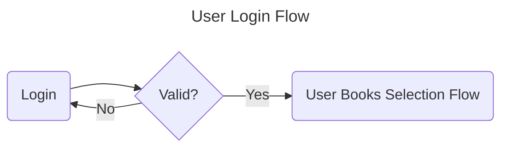
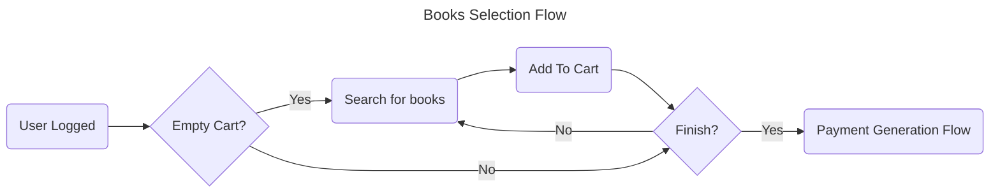
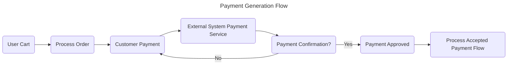
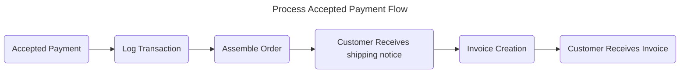
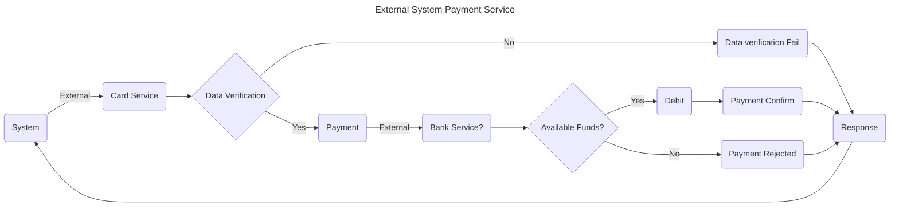
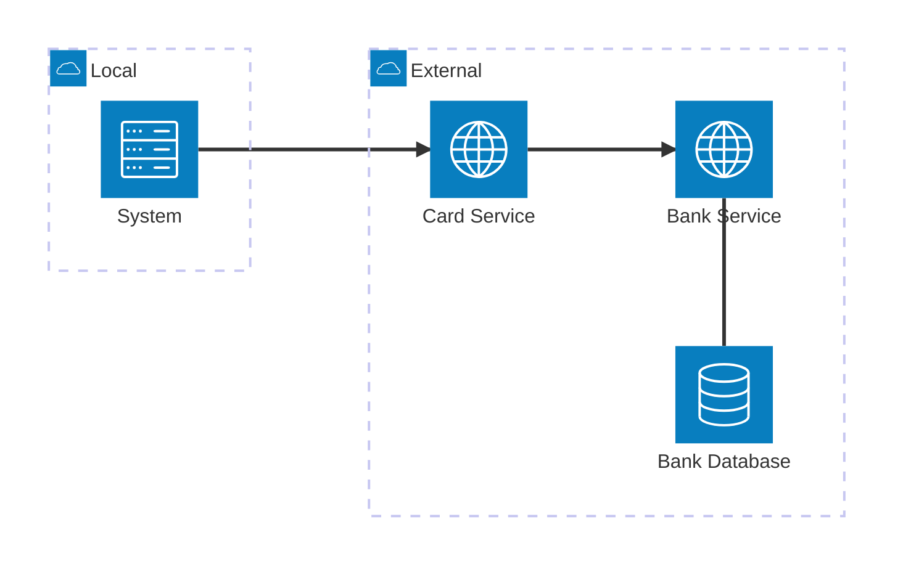

# 2. Analysis

Date: 2024-08-13

## Status

Accepted

## Context

### Explore the problem

Consider a **book store** in a shopping mall. The **customer** selects the **books** from racks to purchase and put them into a shopping **Cart**. The customer brings the **Cart** with the selected **books** to cashier. The cashier scans each item with checkout **system** to prepare an **order**. The cashier **requests to customer for payment**. The customer gives **credit card** to cashier. The **verifier and checkout system scans the card**. The **verifier accepts the card and payment is accepted**. **Customer signs the credit card** slip. The **purchased books are handed over to customer**.

### Scenarios and User Stories documentation

In this point we **express the needs that the user have in a form of user stories. It specifies the outcome that the user need**

#### 1. User Login



```gherkin
Feature: User Login
  As a user
  I want to be able to log in with valid credentials
  So that I can access the system

Scenario: Valid login
  Given I have provided valid username and password
  When I submit the login form
  Then I should see the Books Selection Flow page

Scenario: Invalid login
  Given I have provided invalid username or password
  When I submit the login form
  Then I should be prompted to re-enter my credentials
  And I will not see the Books Selection Flow page
```

- [Acceptance Criteria](ac/0001-user-login.md)

#### 2. User Books Selection Flow



```gherkin
Feature: Search for books when cart is empty

Scenario:
Given I am a logged-in user
And my cart is empty
When I search for books
Then I should see a list of relevant books
```

```gherkin
Feature: Add book to cart when cart is empty

Scenario:
Given I am a logged-in user
And my cart is empty
When I add a book to my cart
Then the book should be added to my cart
```

```gherkin
Feature: Finish adding books to cart

Scenario:
Given I am a logged-in user
And my cart has books in it
When I finish adding books to my cart
Then I should see an option to proceed with payment
```

```gherkin
Feature: Proceed with payment when cart is not empty

Scenario:
Given I am a logged-in user
And my cart has books in it
When I proceed with payment
Then the payment generation flow should start
```

```gherkin
Feature: Search for books when cart is empty or not empty

Scenario:
Given I am a logged-in user
And my cart is empty or not empty
When I start searching for books
Then I should see a list of relevant books
```

- [Acceptance Criteria](ac/0002-user-books-selection.md)

#### 3. Payment Generation Flow



```gherkin
Feature: Submit payment

Scenario:
Given I am a logged-in user with books in my cart
When I submit my payment information
Then the system should process my order
```

```gherkin
Feature: Process Order

Scenario:
Given I am a logged-in user with books in my cart
When I submit my payment information
Then the system should process my order and validate my payment information
```

```gherkin
Feature: Validate Payment Information

Scenario:
Given I am a logged-in user with books in my cart
When I submit my payment information
Then the system should validate my payment information and display a confirmation message if valid
```

```gherkin
Feature: Process Accepted Payment

Scenario:
Given I am a logged-in user with books in my cart
And my payment information has been validated as valid
When I submit my payment information
Then the system should process my accepted payment and display a confirmation message
```

- [Acceptance Criteria](ac/0003-payment-generation.md)

#### 4. Process Accepted Payment Flow



```gherkin
Feature: Log Transaction

Scenario:
Given I have submitted my payment information and it has been approved
When the system logs my transaction
Then the transaction should be recorded and confirmed in the database
```

```gherkin
Feature: Assemble Order

Scenario:
Given I have logged my payment transaction successfully
When the system assembles my order
Then the system should confirm that all items in my cart are included in my order
```

```gherkin
Feature: Customer Receives Shipping Notice

Scenario:
Given I have assembled my order successfully
When the system generates and sends me a shipping notice
Then I should receive a notification with details about my shipment
```

```gherkin
Feature: Create Invoice

Scenario:
Given I have assembled my order and shipped it successfully
When the system generates an invoice for my order
Then the invoice should be created with accurate details about my purchase
```

```gherkin
Feature: Receive Invoice

Scenario:
Given I have assembled my order and shipped it successfully
When the system generates and sends me an invoice
Then I should receive an accurate invoice with details about my purchase
```

- [Acceptance Criteria](ac/0004-process-accepted-payment.md)

## Formal Verification

### Acceptance Criteria

We will use **Payment Generation Flow** with the following acceptance criteria




- Architecture diagram for External api



- [Defined Acceptance Criteria](ac/0003-payment-generation.md)

### P Language model checker

#### Specifications

check [clientserver PSpec](https://github.com/p-org/P/tree/master/Tutorial/1_ClientServer/PSpec)

#### Executable Specification

check [PTst](https://github.com/p-org/P/tree/master/Tutorial/1_ClientServer/PTst)

### Quint model checker

- [bft](https://protocols-made-fun.com/consensus/matterlabs/quint/specification/modelchecking/2024/07/29/chonkybft.html)
- [zksync-governance](https://protocols-made-fun.com/zksync/matterlabs/quint/specification/modelchecking/2024/09/12/zksync-governance.html)

## Decision

## Consequences

What becomes easier or more difficult to do, and any risks introduced by the change that will need to be mitigated.
