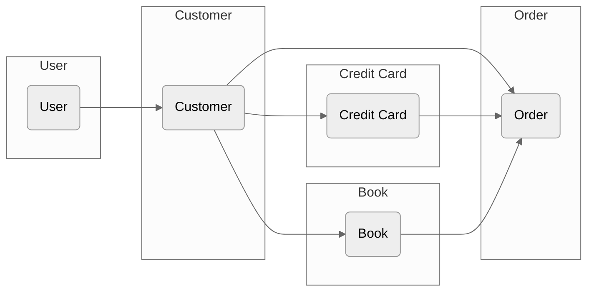
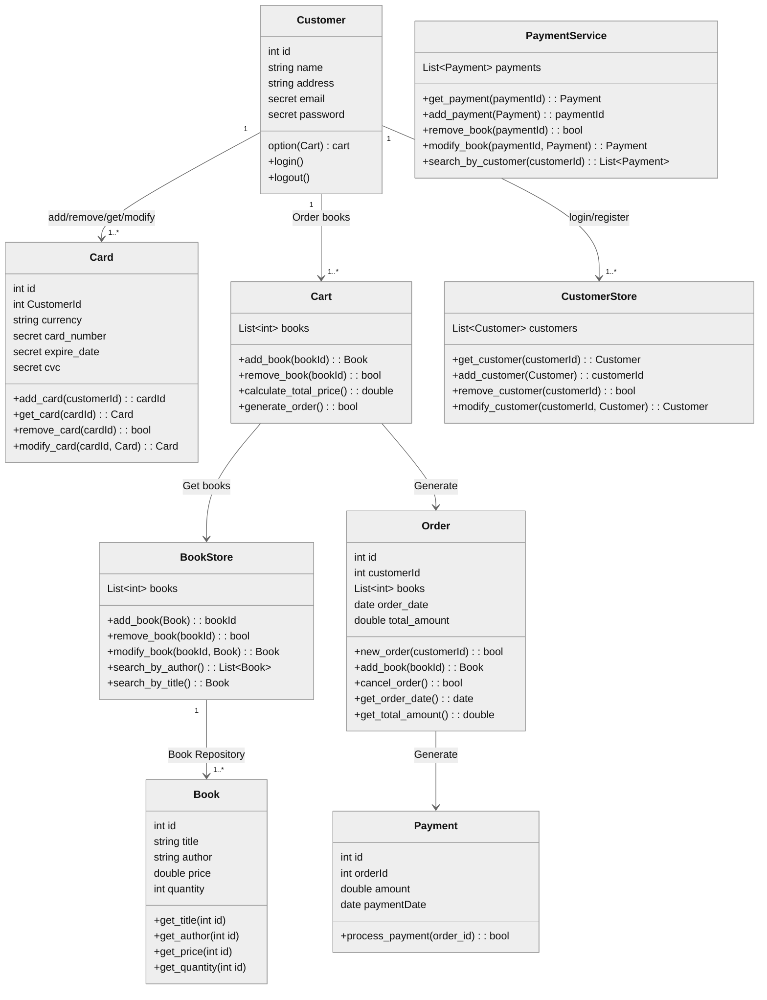
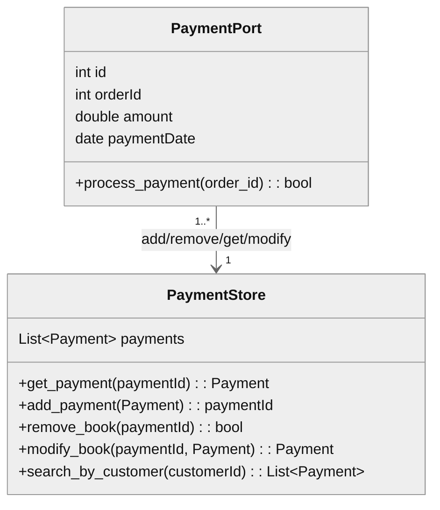
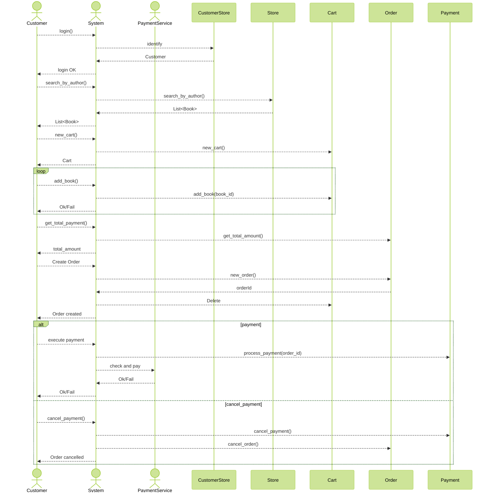
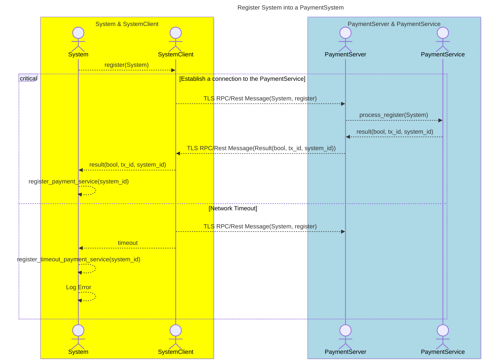
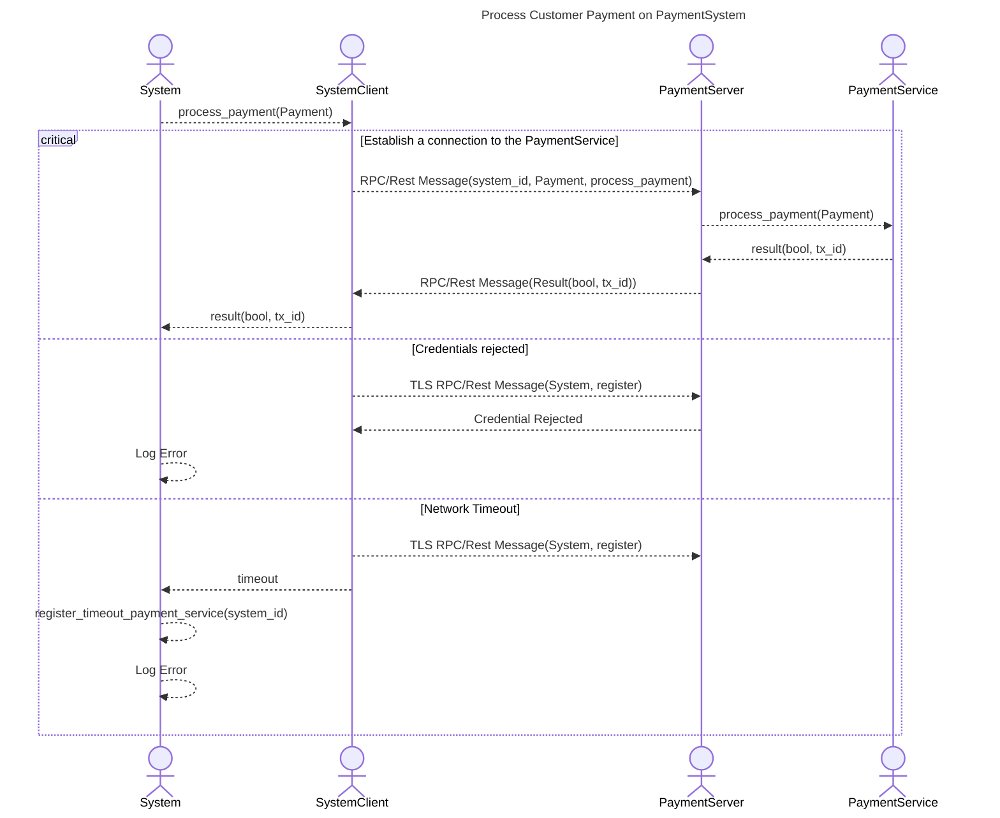
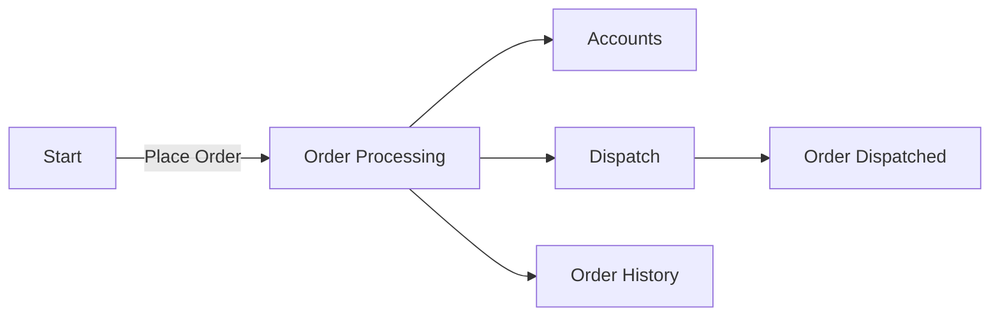
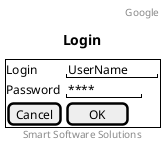

# 3. correctness and resiliency

Date: 2024-08-13

## Status

Accepted

## Context

Consider a **book store** in a shopping mall. The **customer** selects the **books** from racks to purchase and put them into a shopping **Cart**. The customer brings the **Cart** with the selected **books** to cashier. The cashier scans each item with checkout **system** to prepare an **order**. The cashier **requests to customer for payment**. The customer gives **credit card** to cashier. The **verifier and checkout system scans the card**. The **verifier accepts the card and payment is accepted**. **Customer signs the credit card** slip. The **purchased books are handed over to customer**.

## Main Goal

- Create an online shopping that allow clients to search, select and purchase books.
- The system architecture should be **compositional distributed system**
- Service oriented architecture (SOA) (Microservices)

### Sub Goals

- The system should be distributed, secure and scalable.
- Availability "five nines", fault-tolerant

## Design

### UML Structural diagrams

- Architecture
- Component

#### UML Behavioral diagrams
  
##### Information Flow (security)

##### Use Case

##### Activity

##### State Machine

##### Class Diagram

##### Book Persistence

##### Payment Persistence

##### Sequence

##### Communication

### Prototyping

- Implementation
- Unit Tests
- Integration Tests

#### Login

authentication executable specification (analyses)

Design

- could be a web login
- or fingerprint login
- or face recognition login

## Decision

The change that we're proposing or have agreed to implement.

## Consequences

What becomes easier or more difficult to do and any risks introduced by the change that will need to be mitigated.
